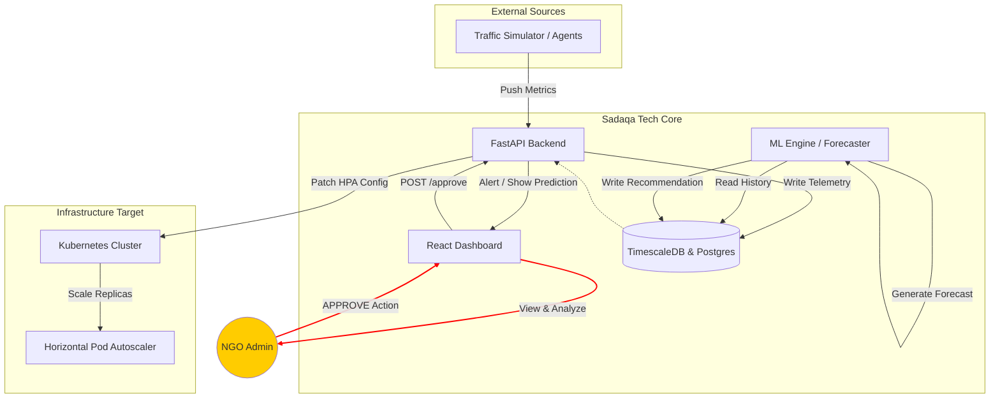

# Sadaqa Tech

[](https://github.com)
[](LICENSE)
[](https://www.python.org)
[](https://www.typescriptlang.org)
[](https://react.dev)
[](https://fastapi.tiangolo.com)
[](https://www.postgresql.org)
[](https://www.timescale.com)
[](https://kubernetes.io)
[](https://www.docker.com)

> **Operational Intelligence for NGO Infrastructure During Ramadan**

An AI-assisted infrastructure monitoring and predictive scaling system for charitable platforms during predictable high-traffic religious events.

**Hackathon:** RamadanIA Hackathon 2026 | **Location:** Morocco | **Status:** Hackathon MVP

---

## Core Principle

**Prediction before automation. No feature is acceptable if it hides failure modes or lacks human approval gates.**

### One-Sentence Definition

Sadaqa Tech is a read-only infrastructure observability system that predicts short-term traffic surges during Ramadan and produces guarded scaling recommendations that require human approval.

---

## The Problem

Charity platforms fail during Ramadan due to **delayed reaction to predictable traffic surges**.

### Observed Issues

- Traffic increases follow recurring temporal patterns
- Teams rely on reactive alerts (response happens _after_ degradation)
- Scaling decisions happen too late
- NGOs overprovision due to fear of failure
- Infrastructure costs rise while reliability stays fragile

### Our Solution

Shift reaction **earlier in time** through:

- **Observation:** Monitor metrics in real-time
- **Prediction:** Forecast traffic surges 4+ hours ahead
- **Recommendation:** Suggest scaling actions with full context
- **Approval:** Require human sign-off before execution

**The system does not scale automatically. It assists humans in making better, faster decisions.**

---

## Target Users

### Primary Users

- **NGO Administrators** responsible for uptime decisions
- **Technical Operators** managing deployments

### Non-Users (Explicit Exclusions)

- Donors
- Payment providers
- Marketing teams
- End users of charity platforms

**All interfaces, APIs, and outputs are admin-facing only.**

---

## System Architecture

Sadaqa Tech operates as a five-layer pipeline:

```
┌─────────────┐
│ Ingestion   │ Agents or HTTP APIs deliver metrics
├─────────────┤
│ Storage     │ TimescaleDB (time-series), PostgreSQL (state), Redis (cache)
├─────────────┤
│ Analytics   │ Seasonal baselines + LSTM forecasts (when confidence ≥ 0.7)
├─────────────┤
│ Decision    │ Rule-based logic (thresholds, cooldowns, cost caps)
├─────────────┤
│ Execution   │ Manual approval required → Kubernetes scaling
└─────────────┘
```

### Key Constraint

**Data never flows backward.** Scaling actions log telemetry; they do not influence predictions.

### Architecture Diagram



---

## Tech Stack

### Frontend

| Component | Technology               | Notes                             |
| --------- | ------------------------ | --------------------------------- |
| Framework | React + TypeScript       | Modern, type-safe UI              |
| Charts    | Recharts                 | Interactive traffic visualization |
| Auth      | JWT in HTTP-only cookies | Secure token storage              |

### Backend

| Component     | Technology            | Notes                             |
| ------------- | --------------------- | --------------------------------- |
| API Framework | FastAPI + Pydantic    | Python 3.11, async-first          |
| Validation    | Pydantic              | Schema validation at API boundary |
| Auth          | OAuth2 compatible JWT | Tenant-scoped token validation    |

### Machine Learning

| Component | Technology                              | Notes                                              |
| --------- | --------------------------------------- | -------------------------------------------------- |
| Libraries | scikit-learn, TensorFlow, NumPy, Pandas | Python-based ML stack                              |
| Baseline  | Seasonal averages                       | Fallback when LSTM confidence < 0.7                |
| Primary   | LSTM forecast                           | Trained daily on 60+ days history, 24-hour horizon |

### Data Layer

| Component      | Technology  | Notes                                          |
| -------------- | ----------- | ---------------------------------------------- |
| Time-series DB | TimescaleDB | Optimized for metrics, with row-level security |
| Relational DB  | PostgreSQL  | User, tenant, and decision logs                |
| Cache          | Redis       | Optional caching layer                         |

### Infrastructure & Observability

| Component        | Technology      | Notes                               |
| ---------------- | --------------- | ----------------------------------- |
| Containerization | Docker          | Multi-service deployment            |
| Orchestration    | Kubernetes 1.28 | NGINX Ingress, HPA for scaling      |
| Metrics          | Prometheus      | System and business metrics         |
| Dashboards       | Grafana         | Real-time visualization             |
| Logging          | Fluentd         | Structured logs with tenant context |
| Alerts           | Alertmanager    | Alert aggregation and routing       |
| Message Broker   | Apache Kafka    | Event streaming (optional)          |

### CI/CD & IaC

| Component      | Technology     | Notes                            |
| -------------- | -------------- | -------------------------------- |
| Source Control | GitHub         | Version control                  |
| Pipelines      | GitHub Actions | Automated testing and deployment |
| Deployment     | ArgoCD         | GitOps-based deployments         |
| IaC            | Terraform      | Cloud/K8s resource provisioning  |

### Security

| Component      | Technology            | Notes                                |
| -------------- | --------------------- | ------------------------------------ |
| Secrets        | Kubernetes Secrets    | No env vars in code                  |
| Encryption     | TLS + AES-256 at rest | Data in transit and at rest          |
| API Gateway    | Kong                  | Rate limiting and request validation |
| Access Control | RBAC                  | Role-based access control            |

### Testing & Simulation

| Component    | Technology              | Notes                      |
| ------------ | ----------------------- | -------------------------- |
| Load Testing | Locust                  | Stress testing workloads   |
| Traffic Sim  | Custom Python Generator | Synthetic Ramadan patterns |

---

## Project Structure

```
sadaqa-tech/
├── README.md                          # This file
├── CONTEXT.md                         # Detailed philosophy and constraints
├── implementation_steps.md            # Step-by-step build guide (24-48 hrs)
├── .env.example                       # Environment variables template
├── .github/
│   └── copilot-instructions.md        # AI agent development guidelines
│
├── architecture/
│   ├── system_architecture.json       # Complete tech stack definition
│   ├── project_structure.md           # Directory layout explanation
│   └── system_interaction_graph.md    # Mermaid diagram of data flow
│
├── backend/
│   └── app/
│       ├── api/                       # Routes (ingest, dashboard, approval)
│       ├── core/                      # Config, constants, env vars
│       ├── db/                        # Database session and CRUD
│       ├── models/                    # Pydantic schemas
│       ├── services/                  # Business logic (forecaster, scaling)
│       └── main.py                    # FastAPI app entry point
│
├── frontend/
│   └── src/
│       ├── components/                # Recharts dashboard, action center
│       ├── pages/                     # Admin dashboard, login
│       ├── hooks/                     # API data fetching
│       ├── context/                   # JWT auth context
│       └── index.tsx                  # React entry point
│
├── ml_engine/
│   ├── training/                      # LSTM / seasonal model training scripts
│   ├── inference/                     # Prediction service
│   └── notebooks/                     # EDA and experiments
│
├── simulator/
│   ├── traffic_gen.py                 # Locust or custom Ramadan traffic generator
│   └── profiles.json                  # Traffic multipliers (Suhoor, Iftar, Normal)
│
└── infra/
    ├── docker/
    │   ├── Dockerfile.backend         # FastAPI container
    │   ├── Dockerfile.frontend        # React build container
    │   ├── docker-compose.yml         # Local dev stack (TimescaleDB, Redis)
    │   └── init.sql                   # Database schema and seed data
    │
    ├── k8s/
    │   ├── deployment.yaml            # Kubernetes Deployment
    │   ├── service.yaml               # Kubernetes Service
    │   ├── hpa.yaml                   # HorizontalPodAutoscaler config
    │   └── ingress.yaml               # NGINX Ingress routing
    │
    └── terraform/
        ├── main.tf                    # Cloud/K8s resource definitions
        ├── variables.tf               # Input variables
        └── outputs.tf                 # Exported values
```

---

## Quick Start

### Phase 0: Environment Setup (5 min)

Initialize the monorepo structure:

```bash
git clone <repo>
cd sadaqa-tech
cp .env.example .env

# Create directory structure
mkdir -p backend/app/{api,core,db,models,services}
mkdir -p frontend/src/{components,pages,hooks,context}
mkdir -p infra/{docker,k8s,terraform}
mkdir -p ml_engine/{training,inference,notebooks}
mkdir -p simulator
```

### Phase 1: Database & Docker (10 min)

Start the data layer:

```bash
# Create docker-compose.yml with TimescaleDB and Redis
docker-compose up -d

# Verify connection
docker logs $(docker-compose ps -q timescaledb)
```

### Phase 2: Backend (15 min)

Set up FastAPI:

```bash
cd backend
python -m venv venv
source venv/bin/activate
pip install fastapi uvicorn sqlalchemy asyncpg pydantic python-dotenv

# Run the API
uvicorn app.main:app --reload
# Visit: http://localhost:8000/docs
```

### Phase 3: Simulator (5 min)

Start generating traffic:

```bash
cd simulator
pip install requests
python traffic_gen.py
```

### Phase 4: Frontend (10 min)

Build the React dashboard:

```bash
cd frontend
npm create vite@latest . -- --template react-ts
npm install axios recharts lucide-react tailwindcss
npm run dev
# Visit: http://localhost:5173
```

### Phase 5: ML Engine (10 min)

Implement the forecaster:

```bash
# Create backend/app/services/forecaster.py
# - Hardcode Ramadan window
# - Implement predict_next_hour(history)
# - Return SURGE_DETECTED or DROP_EXPECTED
```

### Phase 6: Integration & Testing (20 min)

Connect all components:

1. Watch traffic surge on the chart
2. Wait for prediction alert in Action Center
3. Click "Approve"
4. See scaling recommendation logged

---

## Machine Learning Strategy

### Baseline Model (Fallback)

- **Approach:** Seasonal averages per day-of-year and hour-of-day
- **Ramadan Day Indexing:** day 1–30 of the Hijri calendar
- **Used When:** LSTM confidence < 0.7 or on cold starts

### LSTM Forecast (Primary)

- **Training:** Daily on 60+ days of history
- **Horizon:** 24 hours ahead
- **Feature Engineering:** Trend, seasonality, event flags
- **Fallback:** Automatic switch to baseline on model failure

### Confidence Threshold

- Predictions only trigger alerts when model confidence ≥ 0.7
- Always validate output against sensible bounds (0–5× current load)

---

## Scaling Logic

All scaling is **recommendation-first and human-approved**:

### Hard Limits

- **Max Replicas:** 50 (safety cap)
- **Cooldown:** 5 minutes between actions
- **Cost Caps:** Admin-defined per tenant

### Example Recommendation

> "Forecast shows 3× load in 4h; current replicas: 10; recommended: 25; cost impact: +$120/h."

### Human Approval Gate

1. System detects surge prediction
2. Dashboard displays recommendation with full context
3. Admin reviews and clicks "Approve"
4. Only then does Kubernetes scaling occur

---

## Security & Tenancy

### Multi-Tenancy by Design

- **Every metric carries `tenant_id`**
- Database row-level security enforces isolation
- API layer filters all queries by tenant
- Dashboards query-scoped to authenticated tenant
- **No cross-tenant aggregation** in MVP

### Security Posture

- **In Scope:** TLS, AES-256 at rest, RBAC, audit logs, rate limiting
- **Out of Scope:** Zero-trust networking, payment PCI compliance, multi-region disaster recovery
- Secrets stored in Kubernetes Secrets (never env vars)
- JWT tokens: short-lived with tenant scope

### Explicit Exclusions

- ❌ No payment processing
- ❌ No donor personal data (PII) handling
- ❌ No autonomous cloud resource purchasing
- ❌ No multi-region replication
- ❌ No legal compliance enforcement

---

## Core Operating Principles

These principles override all technical preferences:

1. **Prediction never bypasses rules** — ML output is constrained, not autonomous
2. **Rules never bypass humans** — Every scaling action requires approval
3. **Humans never bypass visibility** — All decisions logged and explainable
4. **Simplicity beats sophistication** — Clarity > performance
5. **Failure must be visible and explainable** — No silent failures

**If a contribution violates a principle, it must be removed.**

---

## 📚 Key Documentation Files

| File                                                                                 | Purpose                                                  |
| ------------------------------------------------------------------------------------ | -------------------------------------------------------- |
| [CONTEXT.md](CONTEXT.md)                                                             | Detailed project philosophy, constraints, and boundaries |
| [implementation_steps.md](implementation_steps.md)                                   | Step-by-step build guide for 24-48 hour hackathon        |
| [.github/copilot-instructions.md](.github/copilot-instructions.md)                   | AI agent development guidelines and patterns             |
| [architecture/system_architecture.json](architecture/system_architecture.json)       | Complete tech stack definition in JSON                   |
| [architecture/project_structure.md](architecture/project_structure.md)               | Directory layout and purpose of each folder              |
| [architecture/system_interaction_graph.md](architecture/system_interaction_graph.md) | Mermaid diagram of data flow and interactions            |

---

## For Hackathon Judges

### Evaluation Criteria

**Clear problem framing:** Ramadan traffic is predictable; teams react too late.

**Working demo:**

- Live traffic chart showing "normal" → "surge" → "drop" cycle
- Prediction alert fires 4+ hours before spike
- Admin approves scaling recommendation
- Kubernetes adjusts replicas

**Visible prediction lead time:** System demonstrates 4+ hour forecasting window.

**Transparent logic:** Every alert includes context, confidence score, and cost impact.

**Honest limits:** Documentation explicitly states MVP boundaries and out-of-scope features.

### Showcase Deliverables

1. **Architecture Diagram** (see above)
2. **Screenshots:**
   - Live dashboard showing "Suhoor Spike"
   - Prediction alert with confidence score
   - Approval workflow
3. **Video (60 seconds):**
   - "Here is normal traffic..."
   - "Simulator enters Suhoor phase..."
   - "System predicts surge..."
   - "I click Approve..."
   - "System logs scaling action"

---

## 🛣️ Development Roadmap

### Phase 1: MVP (Hackathon)

- ✅ Metric ingestion (HTTP API)
- ✅ Time-series storage (TimescaleDB)
- ✅ Seasonal baseline + LSTM forecast
- ✅ Rule-based recommendations
- ✅ Manual approval workflow
- ✅ React dashboard with live charts
- ✅ Traffic simulator with Ramadan patterns

### Phase 2: Incremental Automation

- Better confidence estimation
- Multi-event support (other holidays, events)
- Expanded forecasting horizon
- More sophisticated cost impact modeling

### Phase 3: Operational Excellence

- Production-ready Kubernetes deployment
- Advanced observability (Prometheus, Grafana)
- Audit trails and compliance logging
- NGO trust through transparency

---

## Contributing

Before contributing, read [CONTEXT.md](CONTEXT.md) in full to understand project boundaries.

### When Adding Features

1. Declare explicitly: in-scope or out-of-scope
2. Define failure behavior
3. Add guardrails _before_ intelligence
4. Prefer clarity over novelty

### When Touching ML

- Avoid speculative claims
- Test fallback behavior thoroughly
- Document confidence thresholds

### When Modifying Scaling Logic

- Every rule must have written justification
- Rules are versioned and auditable
- Cost impact must be calculable before execution

### Red Flags (Do Not Merge)

- ❌ Features that bypass human approval
- ❌ Silent failure modes
- ❌ Automation presented as "safe" without proof
- ❌ Implicit assumptions about model accuracy
- ❌ Cross-tenant changes without isolation testing

---

## Support

- **Architecture Questions:** See [architecture/](architecture/)
- **Implementation Help:** See [implementation_steps.md](implementation_steps.md)
- **AI Development:** See [.github/copilot-instructions.md](.github/copilot-instructions.md)
- **Project Philosophy:** See [CONTEXT.md](CONTEXT.md)

---

## License

This project is part of the **RamadanIA Hackathon 2026**.

---

**Last Updated:** February 2026 | **Status:** Hackathon MVP, code scaffolding phase

_"Sadaqa Tech exists to help charities act earlier, not gamble faster."_
