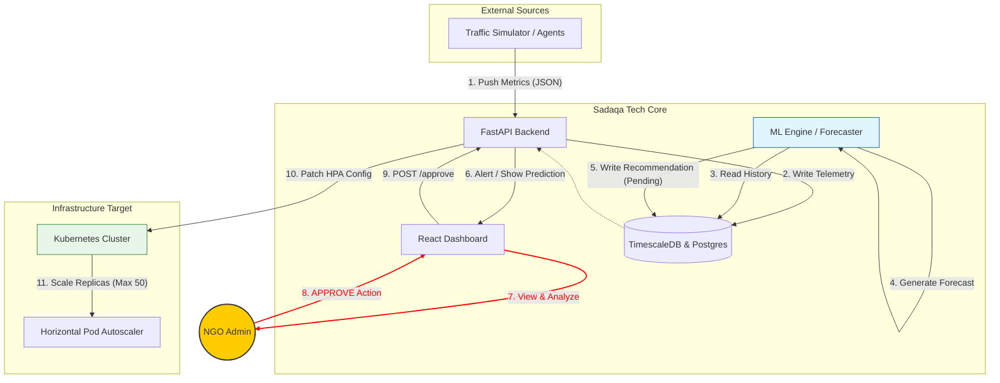

```mermaid
graph TD
    %% Nodes
    subgraph "External Sources"
        Sim[Traffic Simulator / Agents]
    end

    subgraph "Sadaqa Tech Core"
        UI[React Dashboard]
        API[FastAPI Backend]
        DB[(TimescaleDB & Postgres)]
        ML[ML Engine / Forecaster]
    end

    subgraph "Infrastructure Target"
        K8s[Kubernetes Cluster]
        HPA[Horizontal Pod Autoscaler]
    end

    User((NGO Admin))

    %% Data Ingestion Flow (High Frequency)
    Sim -- "1. Push Metrics (JSON)" --> API
    API -- "2. Write Telemetry" --> DB

    %% Prediction Flow (Scheduled)
    ML -- "3. Read History" --> DB
    ML -- "4. Generate Forecast" --> ML
    ML -- "5. Write Recommendation (Pending)" --> DB

    %% The "Human-in-the-Loop" Decision Flow
    DB -.-> API
    API -- "6. Alert / Show Prediction" --> UI
    UI -- "7. View & Analyze" --> User
    User -- "8. APPROVE Action" --> UI
    UI -- "9. POST /approve" --> API

    %% Execution Flow
    API -- "10. Patch HPA Config" --> K8s
    K8s -- "11. Scale Replicas (Max 50)" --> HPA

    %% Styling
    linkStyle 7,8 stroke:#FF0000,stroke-width:2px,color:red;
    style User fill:#ffcc00,stroke:#333,stroke-width:2px;
    style ML fill:#e1f5fe,stroke:#01579b;
    style K8s fill:#e8f5e9,stroke:#2e7d32;
```
